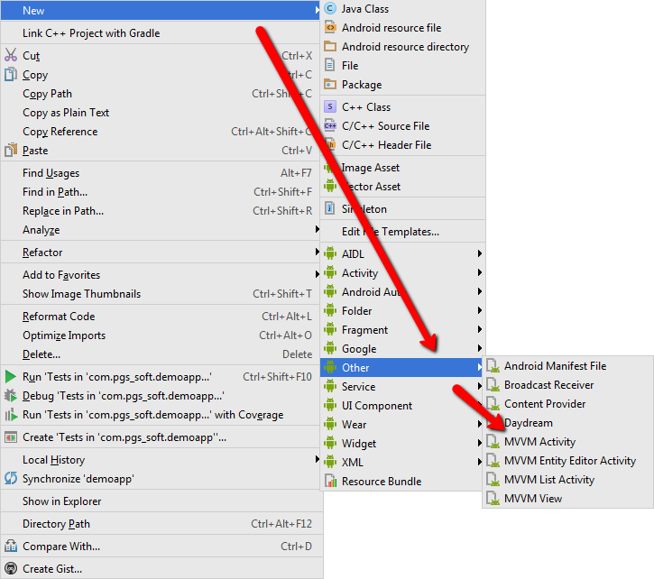
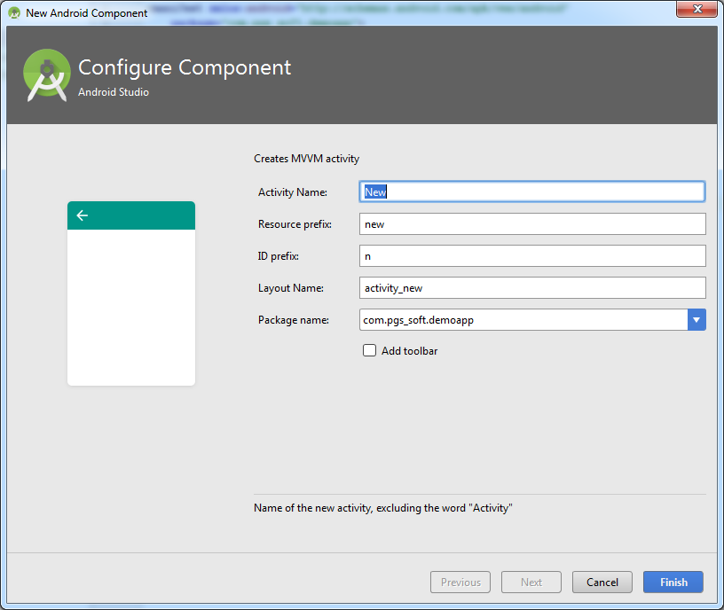
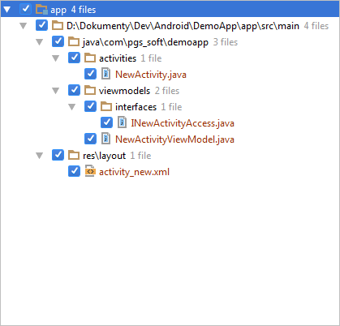
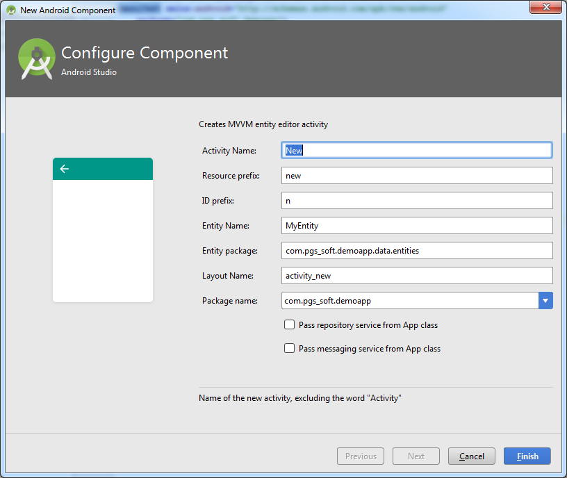
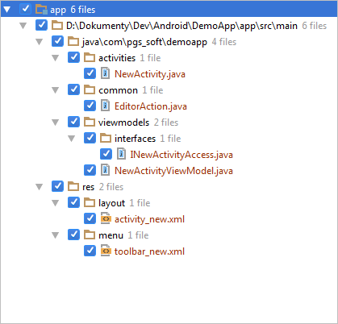
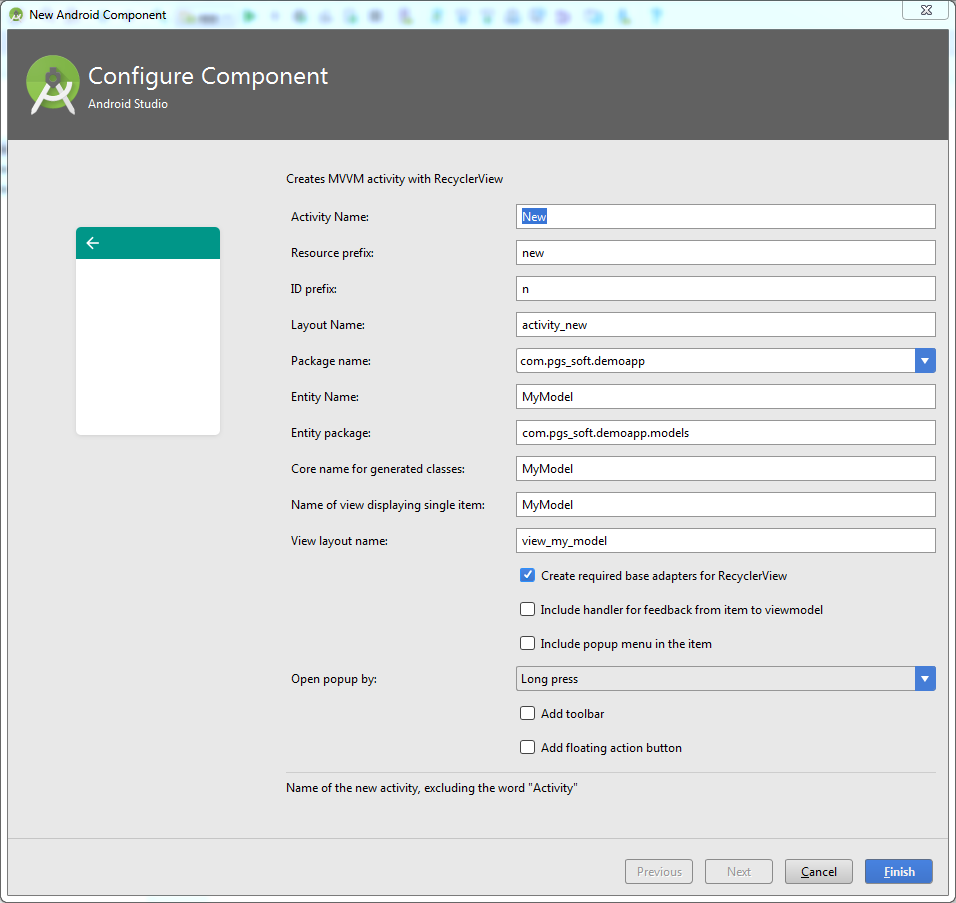
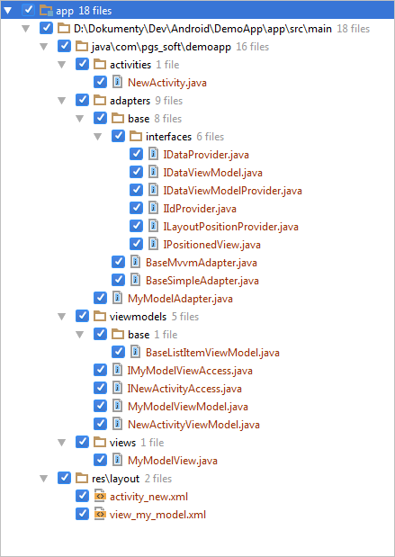
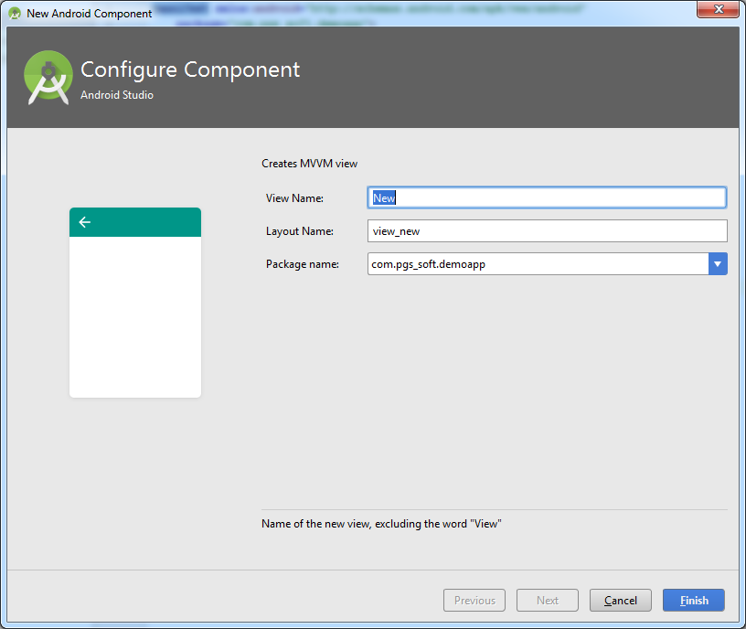
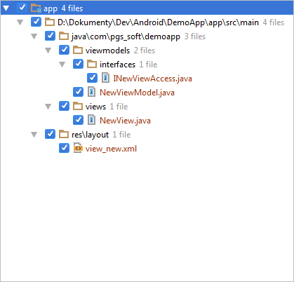
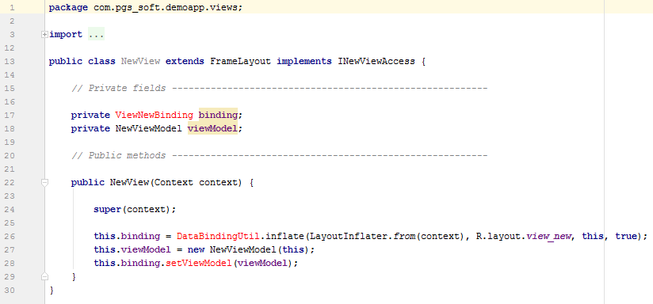

# Android MVVM Templates

A couple of MVVM templates for use in Android Studio

## Introduction

Android Studio provides a set of built-in templates for creating different parts of Android application: activities, fragments, broadcast receivers, content providers and so on. IDE does not officially support creating own templates, but this is possible by putting appropriate files in Android Studio's folder. For those interested, Android Studio uses [FreeMarker Java Template Engine](http://freemarker.org).

## Installation

1. Shutdown Android Studio

2. Copy folders with templates from `Templates` folder into:

   ```
   C:\Program Files\Android\Android Studio\plugins\android\lib\templates\other
   ```

3. Start Android Studio.

## Usage

You may access all templates through `New | Other` menu:



It is advised to run all templates on root package of your project - they put files in different packages, depending on their contents.

All of templates take advantage of Google's Data Binding Library, so make sure, that you enable it in your gradle script for application:

```
android {
    dataBinding {
	    enabled true
	}
}
```

### MVVM Activity



This template creates the following files:



The template:

* Creates activity and registers it in the manifest
* Creates layout with configured XML namespaces and viewmodel variable
* Creates viewmodel for activity
* Creates access from viewmodel to view through an interface
* Inflates layout for activity with DataBindingUtil and stores the binding class in variable

### MVVM Entity editor dialog



This template creates the following files:



The template creates activity, which may serve as a base for editing an entity or model. Since Android Studio reformats contents of template after adding, contents of activity and viewmodel are commented out - simply uncomment them before use.

### MVVM List activity



This template creates the following files:



The template is extended and creates activity, which displays lists of elements. Some highlights:

* You may choose to create base classes for RecyclerView adapters. These simplify process of creating adapters for specific lists.
* You may decide to include handler - an interface, which passes actions from specific items to activity's viewmodel. A dummy action is provided, such that you may track the path of execution.
* You may choose to add popup to list items, triggered either by dedicated button or long press.
* You may choose to include FAB (Floating Action Button).

The template requires some more work - you need to provide a way to load and save entities (eg. from repository), UI for the editor etc. But most work is done for you.

### MVVM View



This template creates the following files:



This template creates a MVVM view. It's similar to MVVM activity - inflates view using DataBindingUtil, creates layout for view etc., but creates a View instead of full activity. It is useful if you want to create a view, which will be dynamically created during run-time, such as ListView or RecyclerView item.

# Known issues

After adding most templates Android Studio will mark some identifiers as invalid:



This is due to one of the reasons:

* Android Studio does not run parser, which generates java files for bindings after applying a template. This is the case, when you use MVVM Activity or MVVM View templates. To get rid of errors either open generated layout file, make a change and save it or simply rebuild the whole project.
* Some templates are commented out to prevent scrambling order of members of generated classes. Also, you need to make some modifications to the code to make it work (this affects MVVM List activity and MVVM Entity editor activity).

# Contributing

Bug reports and pull requests are welcome on GitHub at [https://github.com/PGSSoft/AndroidMvvmTemplates](https://github.com/PGSSoft/AndroidMvvmTemplates).

# License

The project is available as open source under the terms of the [MIT License](http://opensource.org/licenses/MIT).

## About

The project is maintained by [software development agency](https://www.pgs-soft.com/) [PGS Software](https://www.pgs-soft.com/).
See our other [open-source projects](https://github.com/PGSSoft) or [contact us](https://www.pgs-soft.com/contact-us/) to develop your product.

## Follow us

[](https://twitter.com/intent/tweet?text=https://github.com/PGSSoft/AndroidMvvmTemplates)  
[](https://twitter.com/pgssoftware)
